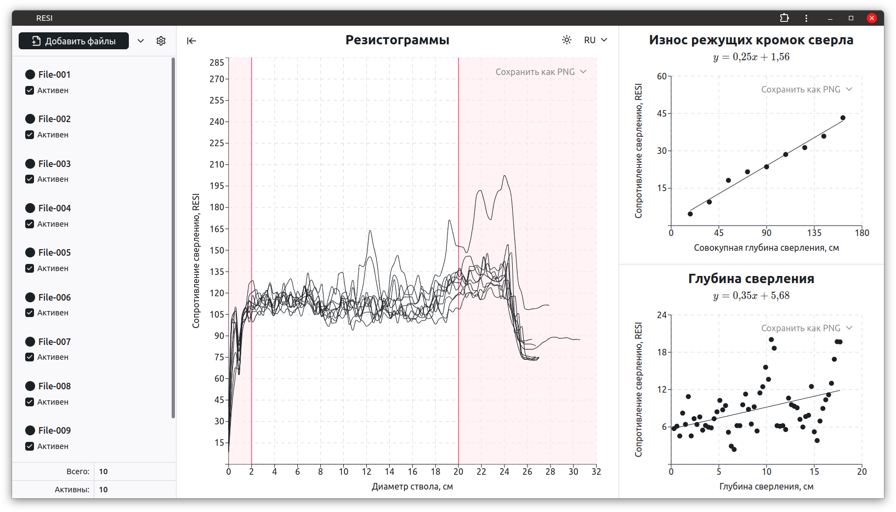

# RESI

Приложение для обработки файлов прибора резистографа. Основные функции – построение графика резистограмм и расчет погрешности сопротивления сверлению, вызванной износом бура и давлением стенок ствола.

_Исследования проведены в рамках государственного задания № 122011300380-5 Федерального исследовательского центра комплексного изучения Арктики имени академика Н.П. Лаверова Уральского отделения Российской академии наук._

## Стек и технологии

1. React
2. Recharts
3. Radix UI, CSS-модули
4. Zustand
5. React Hook Form
6. react-i18next, i18next
7. TypeScript

Сборка:

1. Vite
2. Vite PWA
3. PWA Assets Generator

Тесты:

1. Vitest
2. React Testing Library
3. [Storybook](https://mineew.github.io/resi/storybook/)

Форматирование и линтинг:

1. Prettier
2. Eslint
3. Stylelint
